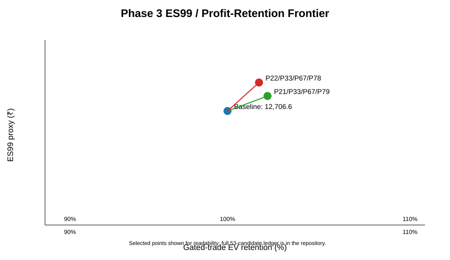
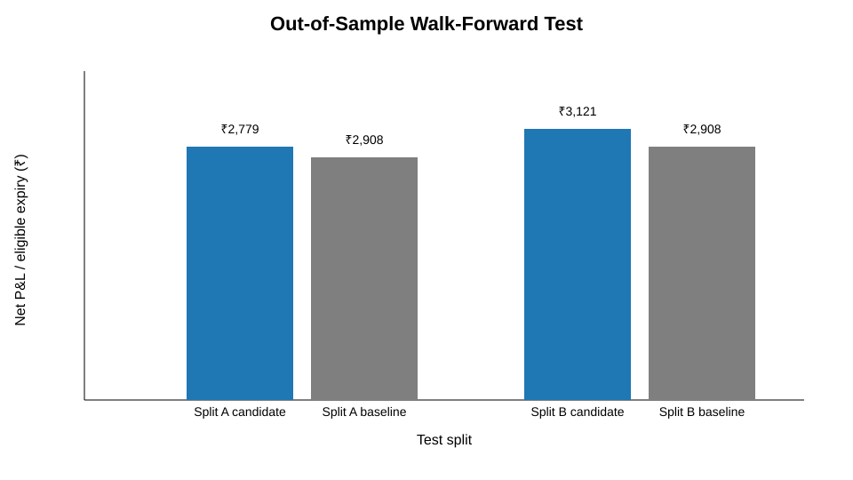
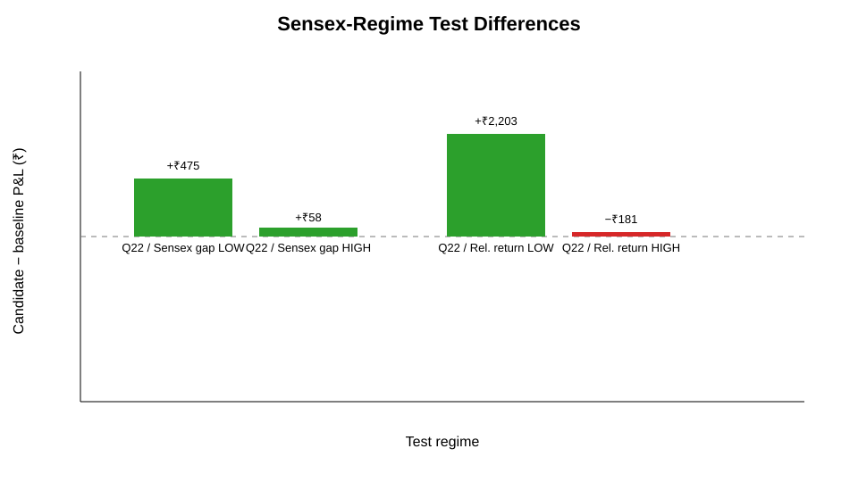

# NIFTY BATMAN Margin-Reduction Research

## Abstract

This study tested whether the strike geometry of a locked NIFTY BATMAN option structure can be altered to reduce capital/risk requirements without unacceptable deterioration in economic performance. The locked control uses a D3-before-expiry 09:30 IST signal, a 756-session bootstrap Monte Carlo with 5,000 paths, a positive gross-MC-EV gate, terminal P20/P35/P65/P80 strike mapping, a +1/-2/+1/-2 leg ratio, first executable observation after 09:30, expiry exit, 2 option-point adverse slippage per leg, historical NIFTY lot sizes, brokerage and STT.

A reproducible 1-minute NIFTY options source was used for execution reconstruction, augmented with 1-minute BSE SENSEX spot data as a non-look-ahead cross-market diagnostic. The Sensex series was incorporated into Phases 2–5 through D3 gap, prior close, prior-20-session return and NIFTY-minus-Sensex relative-return regime fields.

Using the Sensex-aware sample, the corrected baseline contained 97 valid expiry rows and 52 gross-MC-EV-gated trades. Conditional win rate was 76.92%, mean net P&L was ₹1,727.24 per gated trade, median net P&L was ₹2,657.08, and mean ES99 proxy was ₹12,706.60.

The Phase 3 finite search evaluated 53 unique quantile geometries. The strongest in-sample ES99 frontier point was P22/P33/P67/P78, with ES99 about 4.53% below the baseline, mean gated-trade P&L about ₹1,730, mean eligible-expiry P&L about ₹1,017, and a 78.95% win rate. These in-sample findings did not translate into a statistically established out-of-sample improvement.

Chronological Phase 4 testing produced different selected candidates depending on the training window. Split A selected P20.5/P35/P65/P79.5; on the 2026 test period its common-gated mean P&L difference versus baseline was -₹161.18, with a bootstrap 95% CI of approximately [-₹818, +₹335] and paired sign-flip p=1.00. Split B selected P22/P33/P67/P78; on the same 2026 test period its common-gated mean P&L difference was +₹266.12, with a bootstrap 95% CI of approximately [-₹915, +₹1,270] and paired sign-flip p=0.643.

Therefore, the study does not establish a statistically reliable production improvement over the locked BATMAN control. The evidence supports continued research into modestly wider/redistributed strike geometry, but not a production rule change on the present evidence. The main unresolved scientific limitation remains the exact mathematical transformation underlying the project description “756-session bootstrap MC”.

## 1. Research question

Can the four BATMAN strike locations be altered so that capital or risk-capital requirements fall while preserving the baseline's economically relevant profit expectancy and win rate under realistic execution costs?

## 2. Research hypotheses

**Null hypothesis:** no pre-specified strike alteration materially reduces capital/risk requirement while retaining the pre-registered economic tolerance bands.

**Alternative hypothesis:** at least one pre-specified strike alteration reduces the capital/risk requirement while remaining within those economic tolerance bands and surviving chronological out-of-sample validation.

## 3. Locked control

The control arm was kept fixed:

- D3 trading session before expiry;
- 09:30 IST;
- 756-session bootstrap MC;
- 5,000 paths;
- gross MC-EV > 0 gate;
- P20/P35/P65/P80 terminal quantiles;
- +1 P35 PE;
- -2 P20 PE;
- +1 P65 CE;
- -2 P80 CE;
- first executable observation strictly after 09:30;
- expiry exit;
- 2-point adverse slippage on every entry leg;
- historical lot-size schedule;
- brokerage and STT.

The 2-point slippage convention is applied directly to entry cash flow: long legs execute at entry +2 points and short legs at entry -2 points, floored at zero.

## 4. Data sources

### 4.1 Intraday NIFTY/Sensex source

The TradeMarkk India Index & Options 1-minute dataset contains NIFTY, BANKNIFTY and SENSEX index data and 1-minute option files. Its dataset card documents IST timestamps, spot index parquet files and partial coverage for illiquid/far option strikes. The source was used for reproducible intraday execution alignment and was not treated as an official exchange feed.

Repository source lineage is recorded in `research/data_source_manifest.md` and `research/sensex_integration_protocol.md`.

### 4.2 Official BSE verification hierarchy

BSE's market-data service provides index OHLC data for Sensex and other indices, and BSE's Sensex interface exposes historical values. These official sources are retained as the verification hierarchy for the cross-market series.

### 4.3 NSE/NSE Clearing hierarchy

Official NSE/NSE Clearing sources remain the preferred hierarchy for NIFTY settlement, derivatives, FII/DII statistics and historical margin/risk parameters.

## 5. Sensex integration

Sensex was intentionally added as a **diagnostic cross-market variable**, not as an additional hidden signal.

At each D3 date the following fields were stored:

1. post-09:30 Sensex level;
2. previous Sensex close;
3. Sensex D3 opening gap;
4. prior-20-session Sensex log return;
5. prior-20-session NIFTY log return;
6. NIFTY minus Sensex prior-20-session log return.

Only information observable by 09:30 IST was allowed into a regime label. No expiry-day or post-entry Sensex information was used to construct a signal.

## 6. Statistical methodology

The research was divided into five phases.

### Phase 1 — literature/data audit

The project reviewed option portfolio optimisation, option-tail-risk, margin-constrained trading, bootstrap/Monte Carlo inference, Indian option-market microstructure and official exchange data availability. Contract calendars, NIFTY lot-size history, transaction-cost assumptions and intraday data limitations were documented.

### Phase 2 — baseline reconstruction

At each eligible expiry:

- identify D3;
- construct the provisional 756-session bootstrap;
- generate 5,000 terminal paths;
- calculate gross MC-EV;
- apply the gross-EV gate;
- obtain P20/P35/P65/P80;
- map to distinct listed strikes;
- execute at the first positive-volume observation after 09:30;
- apply slippage, brokerage, STT and historical lot size;
- settle at expiry.

No forward-filling of missing execution observations was permitted.

### Phase 3 — finite strike search

53 unique quantile geometries were evaluated. The leg ratio remained +1/-2/+1/-2 so that strike geometry was isolated before testing leg-ratio changes.

Candidate feasibility required:

- at least 20 gated observations for the retention frontier;
- at least 95% of baseline net P&L per eligible expiry;
- at least 95% of baseline net P&L per gated trade;
- no more than 2 percentage points of win-rate deterioration.

Primary risk metric: ES99 proxy. Secondary metrics: ES95 and a ±9.3% spot-shock loss proxy.

### Phase 4 — walk-forward validation

Two chronological splits were used.

**Split A**
- training through 2025-06-30;
- validation 2025-07-01 through 2025-12-31;
- final test from 2026-01-01.

**Split B**
- training through 2025-12-31;
- final test from 2026-01-01.

Candidates were selected only from training data.

Inference on the common-gated test observations used a 10,000-replicate paired bootstrap and 10,000-replicate sign-flip permutation.

Sensex regime thresholds were learned only from training data and frozen for the later validation/test windows.

### Phase 5 — manuscript/reproducibility

The complete manuscript, figures, tables, data dictionary, workflows, logs and source lineage were assembled in the repository.

## 7. Phase 2 baseline results

| Metric | Sensex-aware baseline |
|---|---:|
| Eligible expiry rows reaching engine | 99 |
| Valid expiry rows | 97 |
| Gross-MC-EV-gated trades | 52 |
| Gate rate among valid rows | 53.61% |
| Win rate | 76.92% |
| Mean net P&L / gated trade | ₹1,727.24 |
| Median net P&L / gated trade | ₹2,657.08 |
| Mean ES95 proxy | ₹12,234.13 |
| Mean ES99 proxy | ₹12,706.60 |
| Mean ±9.3% spot-shock loss proxy | ₹110,577.64 |

One additional expiry was excluded after Sensex integration because no valid post-09:30 Sensex observation was available. No Sensex imputation was performed.

## 8. Phase 3 in-sample search results

### Baseline geometry

P20 / P35 / P65 / P80:

- mean P&L per eligible expiry: ₹925.94;
- mean P&L per gated trade: ₹1,727.24;
- win rate: 76.92%;
- ES99 proxy: ₹12,706.60.

### P21 / P33 / P67 / P79

- mean P&L per eligible expiry: ₹1,149.47;
- mean P&L per gated trade: ₹1,922.39;
- win rate: 79.31%;
- ES99 proxy: ₹12,356.55;
- ES99 reduction versus baseline: about 2.75%.

### P22 / P33 / P67 / P78

- mean P&L per eligible expiry: ₹1,016.80;
- mean P&L per gated trade: ₹1,730.35;
- win rate: 78.95%;
- ES99 proxy: ₹12,130.41;
- ES99 reduction versus baseline: about 4.53%.

The P22/P33/P67/P78 geometry was the strongest in-sample ES99 frontier point under the zero-to-5% profit-retention settings used in the Phase 3 frontier.

## 9. Phase 4 walk-forward results

### Split A — selected from training through June 2025

Selected geometry:

**P20.5 / P35 / P65 / P79.5**

2026 test:

| Metric | Selected candidate | Baseline |
|---|---:|---:|
| Mean P&L / eligible expiry | ₹2,778.75 | ₹2,907.69 |
| Mean P&L / gated trade | ₹3,473.43 | ₹3,634.61 |
| Win rate | 75.00% | 75.00% |
| ES99 | ₹17,543.90 | ₹17,498.25 |
| Common-gated N | 16 | 16 |

Common-gated P&L delta: **-₹161.18**

Paired bootstrap 95% CI: **[-₹818.18, +₹334.65]**

Paired sign-flip p-value: **1.00**

The selected geometry therefore did not preserve the baseline economics in this final test window.

### Split B — selected from training through December 2025

Selected geometry:

**P22 / P33 / P67 / P78**

2026 test:

| Metric | Selected candidate | Baseline |
|---|---:|---:|
| Mean P&L / eligible expiry | ₹3,120.58 | ₹2,907.69 |
| Mean P&L / gated trade | ₹3,900.73 | ₹3,634.61 |
| Win rate | 81.25% | 75.00% |
| ES99 | ₹16,862.01 | ₹17,498.25 |
| Common-gated N | 16 | 16 |

Common-gated P&L delta: **+₹266.12**

Paired bootstrap 95% CI: **[-₹914.74, +₹1,270.04]**

Paired sign-flip p-value: **0.643**

The point estimate is positive, with higher observed win rate and lower ES99, but the uncertainty interval includes both economically negative and positive differences. The paired test therefore does not establish a statistically reliable advantage.

## 10. Sensex-regime robustness

The Sensex analysis was diagnostic, with small cell counts that materially limit inference.

For the Split B-selected P22/P33/P67/P78 geometry:

| Frozen Sensex regime | N | Candidate-baseline mean P&L difference |
|---|---:|---:|
| Sensex D3 gap — LOW | 8 | +₹474.66 |
| Sensex D3 gap — HIGH | 8 | +₹57.59 |
| NIFTY-minus-Sensex prior-20d return — LOW | 3 | +₹2,203.23 |
| NIFTY-minus-Sensex prior-20d return — HIGH | 13 | -₹180.90 |

For the Split A-selected P20.5/P35/P65/P79.5 geometry:

| Frozen Sensex regime | N | Candidate-baseline mean P&L difference |
|---|---:|---:|
| Sensex D3 gap — LOW | 8 | -₹545.45 |
| Sensex D3 gap — HIGH | 8 | +₹223.10 |
| NIFTY-minus-Sensex prior-20d return — LOW | 4 | +₹446.20 |
| NIFTY-minus-Sensex prior-20d return — HIGH | 12 | -₹363.64 |

These regime differences are not stable enough to be used as a trading rule. The low/high partitions also contain too few common-gated observations for strong statistical inference.

## 11. Cost stress

The base model uses 2 points of slippage per leg and ₹20/order brokerage.

The Phase 4 stress layer mechanically shifted direct entry-cost effects to 2.5 and 3.0 points per leg and brokerage multipliers of 0.5x, 1.0x and 1.5x.

For the Split B-selected P22/P33/P67/P78 geometry, the mechanical all-sample stress at 3-point slippage and 1x brokerage produced approximately:

- mean P&L per eligible expiry: ₹1,360;
- median P&L per eligible expiry: ₹3,444;
- win rate under the stress transformation: about 44.44%;
- worst P&L: approximately -₹39,777.

This stress table is explicitly a mechanical direct-entry-cost stress and does **not** constitute a fresh full STT recomputation. It is therefore a secondary robustness diagnostic rather than a replacement for the base ledger.

## 12. Multiple-testing and selection effects

The Phase 3 search contained 53 unique candidate geometries. The training/test separation materially reduces, but does not eliminate, data-mining risk.

The crucial Phase 4 observation is that the candidate selected in Split A was not the candidate selected in Split B, and the two final-test outcomes differed. This is exactly the type of instability that argues against treating the full-sample in-sample frontier as proof of a persistent effect.

## 13. Margin versus risk-capital proxy

The project distinguishes:

1. **exchange margin** — historical SPAN/risk-array or official risk parameter reconstruction where available;
2. **broker margin** — Paytm Money or another broker's historically attributable margin where observable;
3. **risk-capital proxy** — ES95/ES99 and stress-loss measures when exact historical margin cannot be reconstructed.

The ES95/ES99 figures reported here are risk-capital proxies. They must not be interpreted as actual historical Paytm Money margin requirements.

## 14. Discussion

The in-sample search demonstrates that modest changes in BATMAN strike geometry can materially alter the empirical risk profile. Wider or redistributed outer/inner quantiles can lower the ES99 proxy while maintaining similar in-sample expectancy.

However, Phase 4 demonstrates the central difficulty: the apparent benefit is not stable across chronological training windows. One selected geometry underperformed the baseline on the final test, while another showed a favorable point estimate without statistically conclusive evidence.

The Sensex analysis adds cross-market context but does not resolve this instability. Some regimes show positive candidate-baseline differences and others do not, and cell counts are small.

The results therefore support the original scientific hypothesis only in a **provisional mechanism/feasibility sense**, not as evidence of a final tradable superiority.

## 15. Strengths

- locked baseline control;
- reproducible deterministic seed by expiry;
- explicit 2-point slippage on cash flow;
- brokerage and STT treatment;
- historical lot-size handling;
- finite pre-specified candidate space;
- chronological out-of-sample validation;
- paired bootstrap and sign-flip inference;
- explicit Sensex integration without look-ahead;
- full candidate ledger and error logs;
- separation of margin from risk-capital proxies.

## 16. Limitations

### 16.1 Original Monte Carlo definition unresolved

The largest limitation is that the project states “756-session bootstrap MC” without providing the exact original path-generation transformation. This study operationalized it as a bootstrap of daily log returns sampled with replacement over the number of trading-session transitions from D3 to expiry.

All numerical conclusions are therefore provisional with respect to the original strategy implementation.

### 16.2 Intraday data coverage

The open-source option dataset documents partial coverage for illiquid/far strikes. Sensex integration also removed one additional expiry lacking a valid D3 post-09:30 observation.

### 16.3 Historical margin availability

Exact historical exchange/broker margin was not reconstructed for every D3 observation. ES99 and stress loss are transparent risk-capital proxies, not broker margin.

### 16.4 Small final test sample

The 2026 test window contains only 20 valid expiry rows in the walk-forward reconstruction. Common-gated paired comparisons are based on 16 observations, so confidence intervals are necessarily wide.

### 16.5 Stress simplification

The mechanical slippage/brokerage stress isolates direct entry-cost changes and does not fully recompute all second-order STT effects.

## 17. Conclusion

The study **does not establish a statistically reliable production improvement over the locked BATMAN control**.

The P22/P33/P67/P78 configuration is the strongest provisional research candidate from the finite in-sample frontier and, under the later training split, produced a 6.25 percentage-point higher test win rate, higher point-estimate net P&L and lower ES99 than the baseline. However, the 95% bootstrap interval for common-gated P&L crossed zero and the paired sign-flip test was not significant.

The other chronological split selected P20.5/P35/P65/P79.5 and produced slightly worse test P&L and slightly worse ES99.

Therefore, the evidence does not justify changing the locked NIFTY BATMAN production geometry on the current sample.

## 18. Future research

1. Recover the authoritative mathematical implementation of the 756-session Monte Carlo.
2. Re-run all five phases under that exact implementation.
3. Reconstruct historical SPAN/broker margin directly wherever possible.
4. Add longer official NIFTY/BSE histories and expand the Sensex regime sample.
5. Extend cross-market analysis to global overnight equity, VIX/volatility, gold and FX stress states without look-ahead.
6. Only after strike geometry is validated, test limited leg-ratio alterations.
7. Conduct a prospective paper-trading period before any live deployment.

## 19. Reproducibility package

The repository contains:

- phase-specific research plans;
- branch-specific workflows;
- source and data manifests;
- Phase 2 baseline ledger;
- Phase 3 candidate universe and ledger;
- Phase 4 walk-forward and Sensex regime results;
- cost-stress outputs;
- manuscript figures;
- phase-specific error logs;
- status log;
- Sensex integration protocol.

## 20. Final research statement

**Research conclusion:** the hypothesis that BATMAN strike geometry can influence capital efficiency is supported descriptively and in-sample, but the current evidence is insufficient to establish a robust out-of-sample improvement. The correct stopping point is therefore a provisional research conclusion and a recommendation for further validation, not a production strategy change.
